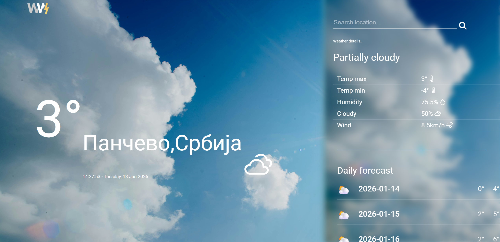
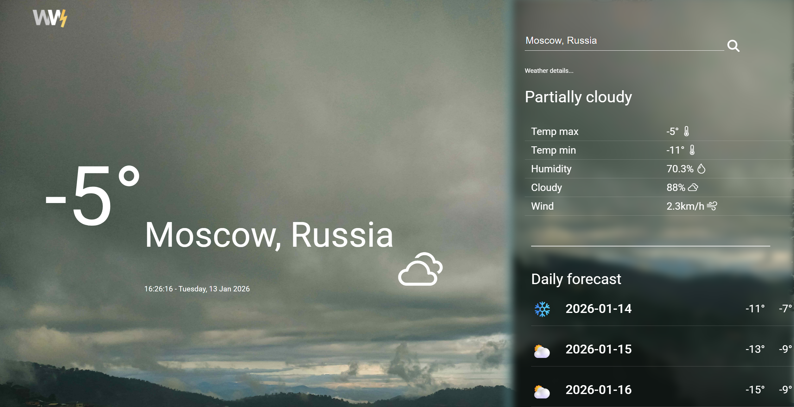

# ☀️ Weather App

Weather App is a React-based web application that allows users to search for the current weather and forecast for any city in the world.  
The app fetches real-time data from a public weather API and displays it in a user-friendly, responsive interface.

This project was built to practice frontend development, API integration, and responsive UI design.

---

## ✨ Features

- Search weather by city
- Uses geolocation to show current location weather
- Display current temperature, weather conditions, and 5 day forecast
- Display additional data such as humidity, wind speed and clouds percentage
- Responsive UI for mobile and desktop
- Error handling for invalid city names or network issues

---

## 🛠️ Tech Stack

- React
- JavaScript (ES6+)
- CSS / CSS Modules / Tailwind CSS
- Fetch API / Axios
- Git & GitHub
- Environment variables for API keys
- Deployment (Vercel)

---

## 📸 Screenshots

---

🧠 What I Learned

- Fetching and displaying data from external APIs
- Handling loading and error states in React
- Managing component state and props
- Responsive UI design
- Deploying a React application

---

## 🚀 Live Demo

Frontend: (https://weather-app-six-azure-76.vercel.app/)

---

## 👤 Author

Anka Knežević 

Junior Frontend / Full-Stack Developer

GitHub: https://github.com/anka131
